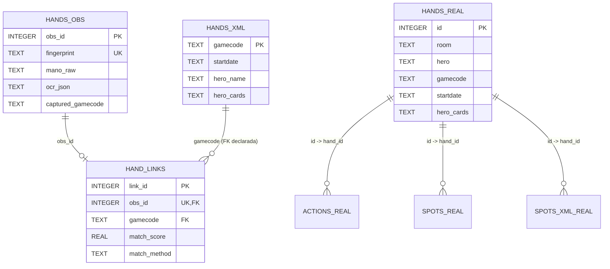

# Reporte de relaciones entre `hands_obs`, `hands_real`, `hand_links` y `hands_xml`

Alcance: este documento describe exclusivamente la base de datos de estrategia `poker_boss`, es decir la DB resuelta por `POKER_BOSS_DB_PATH` o, si no existe override, `data/poker_boss.db`. No cubre `musica_new.db` ni otras bases del repositorio.

Fecha de revisión: 2026-03-13.

## 1. Base activa de `poker_boss`

La resolución de ruta de la DB de la app está definida así:

- `modules/db/config.py`: `POKER_BOSS_DB_PATH` es la variable preferida, `MUSICA_DB_PATH` queda como compatibilidad.
- `modules/db/config.py`: el nombre por defecto es `poker_boss.db`.
- `modules/db/paths.py`: si no hay override por entorno, la DB cae en `./data/poker_boss.db`.

En esta revisión se usó explícitamente:

```text
C:\Users\Usuario\Desktop\proyectos\poker_boss\data\poker_boss.db
```

## 2. Dónde se definen y usan las tablas

### 2.1 `hands_obs`

Definición:

- `modules/db/schema.py`: `CREATE TABLE IF NOT EXISTS hands_obs`

Uso principal:

- `modules/db/repo_obs.py`: `insert_obs(...)` inserta observaciones OCR en `hands_obs` con `INSERT OR IGNORE`.
- `modules/db/repo_obs.py`: `get_obs_by_fingerprint(...)` consulta por `fingerprint`.
- `modules/preflop/link_hands_obs_to_real.py`: lee `obs_id`, `mano_raw`, `detected_at_ms`, `ocr_json`, `captured_gamecode` desde `hands_obs` para enlazar observaciones con manos reales.

### 2.2 `hands_xml`

Definición:

- `modules/db/schema.py`: `CREATE TABLE IF NOT EXISTS hands_xml`

Uso principal:

- `modules/db/repo_xml.py`: `upsert_xml_game(...)` hace `INSERT ... ON CONFLICT(gamecode) DO UPDATE`.
- `modules/db/repo_xml.py`: `get_xml_by_gamecode(...)` consulta una fila por `gamecode`.
- `modules/db/repo_xml.py`: `link_obs_to_game(...)` inserta en `hand_links` asumiendo que `gamecode` referencia a `hands_xml`.

### 2.3 `hand_links`

Definición:

- `modules/db/schema.py`: `CREATE TABLE IF NOT EXISTS hand_links`
- `modules/db/schema.py`: FKs declaradas:
  - `obs_id -> hands_obs(obs_id)`
  - `gamecode -> hands_xml(gamecode)`
- `modules/db/schema.py`: `UNIQUE(obs_id)`

Uso principal:

- `modules/db/repo_xml.py`: `link_obs_to_game(...)` inserta enlaces manuales o programáticos `obs -> gamecode`.
- `modules/preflop/link_hands_obs_to_real.py`: hace `INSERT OR REPLACE INTO hand_links (...)` después de resolver matches contra `hands_real`.

### 2.4 `hands_real`

Definición:

- `modules/importers/championpoker_xml_importer.py`: `CREATE TABLE IF NOT EXISTS hands_real`
- El mismo importador define las tablas hijas:
  - `actions_real` con FK `hand_id -> hands_real(id) ON DELETE CASCADE`
  - `spots_real` con FK `hand_id -> hands_real(id) ON DELETE CASCADE`
  - `spots_xml_real` con FK `hand_id -> hands_real(id) ON DELETE CASCADE`

Uso principal:

- `modules/importers/championpoker_xml_importer.py`: `import_xml_folder(...)` parsea XMLs ChampionPoker e inserta `hands_real`, `actions_real`, `spots_real`, `spots_xml_real`.
- `modules/preflop/link_hands_obs_to_real.py`: consulta `hands_real` por `id`, `gamecode`, `hero_cards`, `startdate`, `hero`, `bb`, `players_json` para encontrar el mejor match con `hands_obs`.

## 3. Esquema resumido y relaciones

### 3.1 `hands_obs`

PK:

- `obs_id`

Columnas relevantes para relación:

- `fingerprint` `UNIQUE`
- `detected_at_ms`
- `mano_raw`
- `ocr_json`
- `captured_gamecode`

Rol:

- representa una observación OCR capturada desde la mesa.

### 3.2 `hands_xml`

PK:

- `gamecode`

Columnas relevantes para relación:

- `sessioncode`
- `startdate`
- `hero_name`
- `hero_cards`
- `players_json`
- `actions_json`

Rol:

- representa una vista resumida de una mano XML keyed por `gamecode`.

### 3.3 `hand_links`

PK:

- `link_id`

Claves y restricciones:

- `obs_id` `NOT NULL`
- `gamecode` `NOT NULL`
- `UNIQUE(obs_id)`
- FK declarada `obs_id -> hands_obs(obs_id)`
- FK declarada `gamecode -> hands_xml(gamecode)`

Columnas operativas:

- `match_score`
- `match_method`
- `created_at_ms`

Rol:

- materializa el enlace entre una observación OCR y un `gamecode`.

### 3.4 `hands_real`

PK:

- `id`

Índice de unicidad:

- `UNIQUE(room, hero, gamecode)`

Columnas relevantes para relación:

- `room`
- `hero`
- `gamecode`
- `startdate`
- `hero_cards`
- `players_json`

Rol:

- representa la mano real importada desde XML completo.

## 4. Cardinalidades

Cardinalidades declaradas por esquema:

- `hands_obs (1) -> (0..1) hand_links`
  - por `UNIQUE(obs_id)` en `hand_links`.
- `hands_xml (1) -> (0..N) hand_links`
  - varios `obs_id` pueden apuntar al mismo `gamecode`.

Cardinalidades lógicas usadas por código:

- `hands_real (0..N) -> (0..N) hand_links` por `gamecode`, pero sin FK declarada.
- En la práctica, el linker intenta que cada `obs_id` quede asociado a un único `gamecode`.
- El linker también evita reutilizar el mismo `gamecode` durante una corrida usando `used_gamecodes`, lo que vuelve el matching efectivo cercano a `1 obs -> 1 gamecode` dentro de esa ejecución.

Importante:

- `hands_real.gamecode` no es `UNIQUE` por sí solo; la unicidad real es `(room, hero, gamecode)`.
- Por tanto, la relación `hand_links.gamecode -> hands_real.gamecode` es lógica, no relacional, y puede ser `0..N` si hubiera más de una fila en `hands_real` con el mismo `gamecode` bajo distinto `room/hero`.

## 5. Flujo de datos actual

### 5.1 OCR -> `hands_obs`

`repo_obs.insert_obs(...)` inserta la observación OCR en `hands_obs` con datos de reconocimiento, payload OCR JSON y, cuando existe, `captured_gamecode`.

Flujo resumido:

1. La captura/OCR produce `fingerprint`, cartas OCR (`mano_raw`), timestamp y `ocr_json`.
2. Se persiste una fila en `hands_obs`.
3. Esa fila queda disponible para linking posterior.

### 5.2 Import XML ChampionPoker -> `hands_real` + hijas

`modules/importers/championpoker_xml_importer.py` parsea XMLs y persiste:

1. `hands_real`
2. `actions_real`
3. `spots_real`
4. `spots_xml_real`

Notas:

- Este importador no escribe en `hands_xml`.
- `hands_real` es la representación más completa del XML hoy operativa en `poker_boss.db`.

### 5.3 Repositorio XML resumido -> `hands_xml` + `hand_links`

`repo_xml.upsert_xml_game(...)` está preparado para mantener `hands_xml`.

`repo_xml.link_obs_to_game(...)` inserta en `hand_links` asumiendo el modelo:

```text
hands_obs.obs_id -> hand_links.obs_id
hands_xml.gamecode -> hand_links.gamecode
```

### 5.4 Linker OCR vs real -> `hand_links`

`modules/preflop/link_hands_obs_to_real.py` hace matching de `hands_obs` contra `hands_real` y luego inserta en `hand_links`.

Orden de matching:

1. Match directo por `captured_gamecode` contra `hands_real.gamecode` con `match_method = gamecode_ocr`.
2. Si no alcanza, match por rango/cartas (`rank_only`).
3. Si hay ambigüedad, la reduce con perfiles de stacks OCR vs `players_json` (`rank+stacks`).
4. Si persiste ambigüedad, compara apuestas preflop a través de `actions_real` (`rank+stacks+bets`).

Conclusión operativa:

- El linker actual usa `hands_real` como fuente de verdad para resolver el `gamecode`.
- Después escribe ese `gamecode` en `hand_links`, aunque la FK declarada apunta a `hands_xml`, no a `hands_real`.

## 6. Diagrama de relaciones

### 6.1 Mermaid



### 6.2 Lectura operativa real

```text
OCR/captura -> hands_obs --(linker)--> hand_links --gamecode--> hands_real
                                        |
                                        +-- FK declarada en schema.py --> hands_xml
```

La segunda flecha es la declarada por esquema. La primera es la que hoy usa efectivamente el linker.

## 7. Estado actual de `data/poker_boss.db`

Conteos ejecutados sobre `C:\Users\Usuario\Desktop\proyectos\poker_boss\data\poker_boss.db`:

```sql
SELECT COUNT(*) FROM hands_obs;   -- 59
SELECT COUNT(*) FROM hands_real;  -- 145
SELECT COUNT(*) FROM hands_xml;   -- 0
SELECT COUNT(*) FROM hand_links;  -- 21
```

Hallazgos adicionales de integridad:

- `PRAGMA foreign_keys = 0`
- `hand_links` con match en `hands_real` por `gamecode`: `21`
- `hand_links` sin fila correspondiente en `hands_xml`: `21`

Interpretación:

- Hoy `hand_links` contiene enlaces útiles hacia `gamecode` que existen en `hands_real`.
- Pero como `hands_xml` está vacía y SQLite no está forzando FKs, esos enlaces quedan huérfanos respecto de la FK declarada en `schema.py`.

## 8. Consulta JOIN ilustrativa con datos reales de `poker_boss`

Dado que `hands_xml` está vacía en esta DB, un `INNER JOIN` con `hands_xml` devolvería `0` filas. Para ilustrar las relaciones reales actuales, la consulta útil es con `LEFT JOIN` a `hands_xml` y `JOIN` a `hands_real`:

```sql
SELECT
  hl.link_id,
  hl.obs_id,
  hl.gamecode,
  hl.match_method,
  ho.mano_raw,
  ho.captured_gamecode,
  hx.gamecode AS xml_gamecode,
  hr.id AS hand_real_id,
  hr.room,
  hr.hero,
  hr.startdate AS real_startdate,
  hr.hero_cards AS real_hero_cards
FROM hand_links hl
JOIN hands_obs ho
  ON ho.obs_id = hl.obs_id
LEFT JOIN hands_xml hx
  ON hx.gamecode = hl.gamecode
LEFT JOIN hands_real hr
  ON hr.gamecode = hl.gamecode
ORDER BY hl.link_id ASC
LIMIT 5;
```

Muestra real obtenida de `poker_boss.db`:

```text
link_id=367 | obs_id=520 | gamecode=12104995642 | match_method=gamecode_ocr | mano_raw=9s5d | captured_gamecode=12104995642 | xml_gamecode=NULL | hand_real_id=16527 | room=championpoker | hero=xavieeee2 | real_startdate=2026-03-12 07:15:45 | real_hero_cards=9s 5d
link_id=368 | obs_id=522 | gamecode=12104995743 | match_method=gamecode_ocr | mano_raw=9d7h | captured_gamecode=12104995743 | xml_gamecode=NULL | hand_real_id=16528 | room=championpoker | hero=xavieeee2 | real_startdate=2026-03-12 07:16:23 | real_hero_cards=9d 7h
link_id=369 | obs_id=524 | gamecode=12104995836 | match_method=gamecode_ocr | mano_raw=JcAd | captured_gamecode=12104995836 | xml_gamecode=NULL | hand_real_id=16518 | room=championpoker | hero=xavieeee2 | real_startdate=2026-03-12 07:16:56 | real_hero_cards=Jc Ad
```

## 9. Conclusiones

1. El modelo relacional declarado para el enlace es `hands_obs -> hand_links -> hands_xml`.
2. El flujo operativo real en `poker_boss` hoy enlaza `hands_obs` contra `hands_real`, no contra `hands_xml`.
3. `hands_real` contiene datos actuales y completos del import XML; `hands_xml` existe a nivel de esquema/repositorio pero en `poker_boss.db` está vacía en esta revisión.
4. Como `PRAGMA foreign_keys` está desactivado, `hand_links` puede almacenar `gamecode` válidos para `hands_real` pero huérfanos respecto de `hands_xml`.
5. Para cualquier análisis actual de relaciones reales en `poker_boss.db`, el join útil hoy es:

```text
hand_links + hands_obs + hands_real
```

y `hands_xml` debe tratarse como tabla prevista por esquema, no como fuente poblada en esta base concreta.
